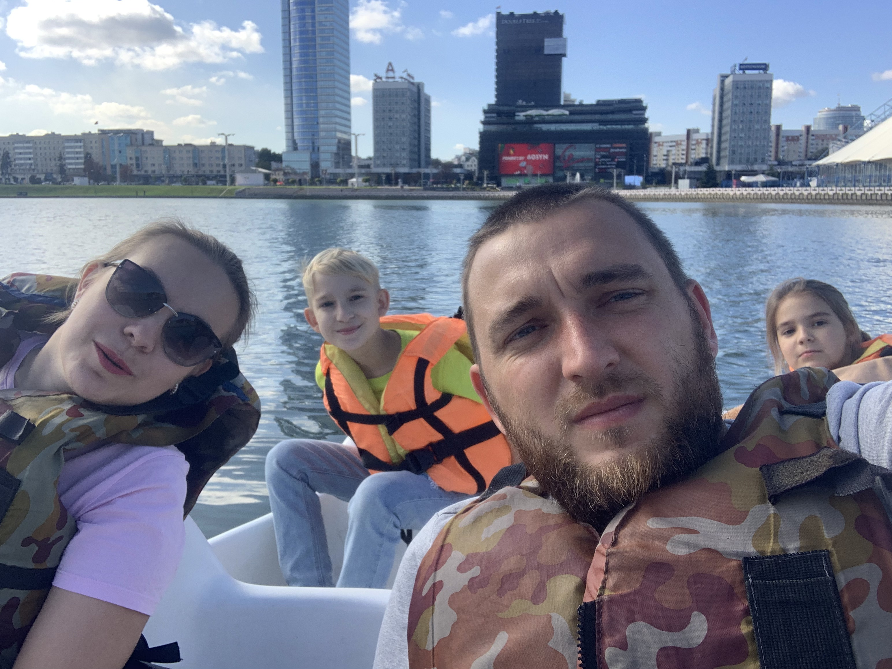

# **Hi all !!!**

My name is Grigoriy.
I am 31 years old.
I have a family.
I have a degree in geodezy.
I am a geodezy engineer, but now I am studying IT coding as i want to bocome a testing engineer.
IT technology is very interesting.
I like this subject.
I love travelling .
I often travel with my wife and children.
IT technology is a great opportunity to work from anywhere in the World. 

My family

Thank you for your time.)))